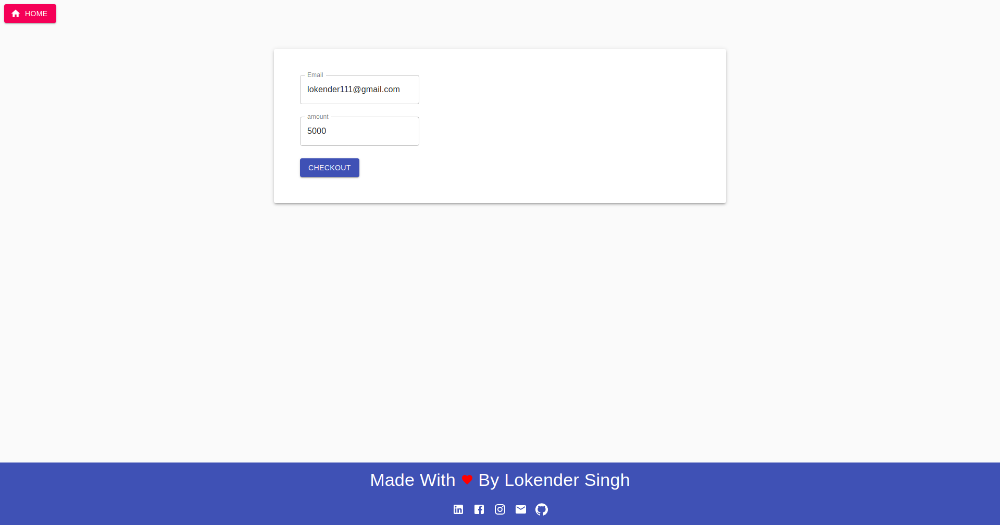
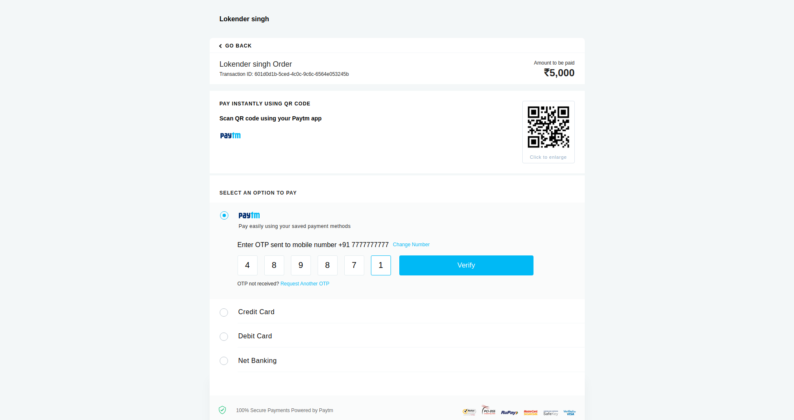
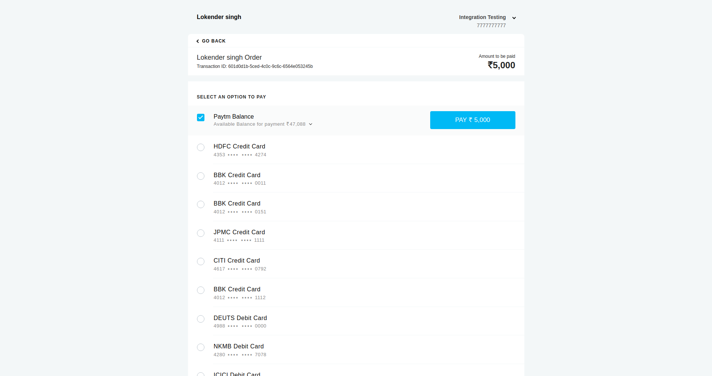
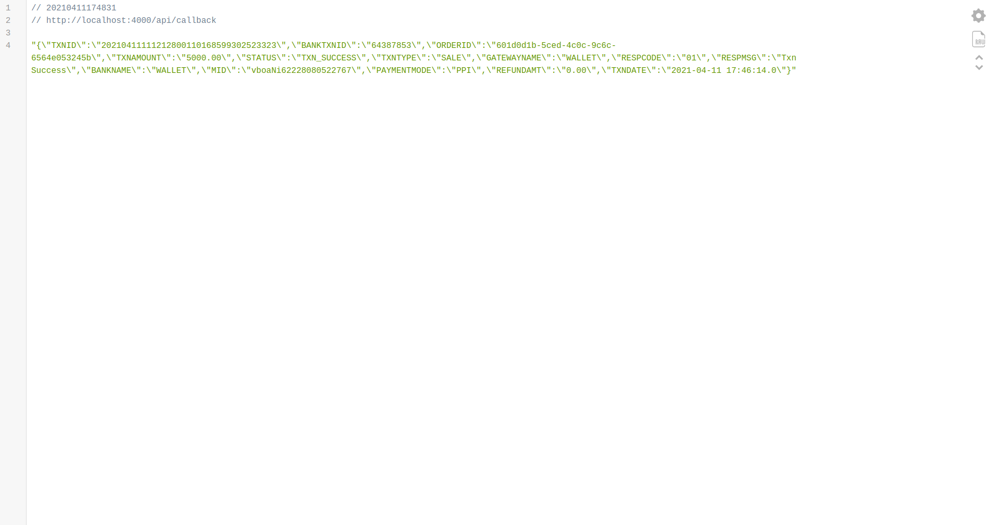

# SIMPLE_MERN_PAYTM_PAYMENT_DEMO
It's a simple example or demo project to demonstrate PayTM payment
it's made by using following technologies
- ReactJS
- NodeJS
- ExpressJS
- MaterialUI

## How To Run 
```
- Server
    1. Move To Server Directory
    cd server/

    2. Install Packages
    yarn

    3. start Server App
    nodemon src/server.js 

- Client    

    1. Move To Client Directory
    cd Client/

    2. Install Packages
    yarn

    3. start Server App
    yarn start
```

## Tasks Completed

1. Homepage
2. payment checkout component
3. Basic server to handle Payment


## Demo ScreenShots

- PayTM - 1
  

- PayTM - 2
  

- PayTM - 3
  

- PayTM - 4
  
